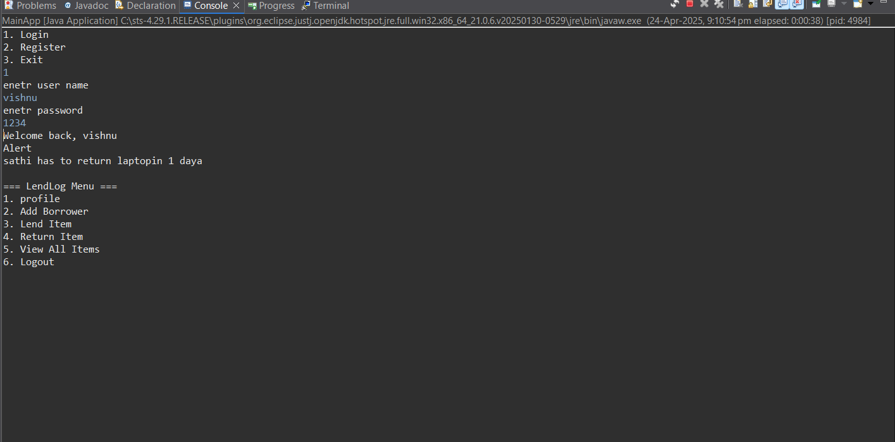
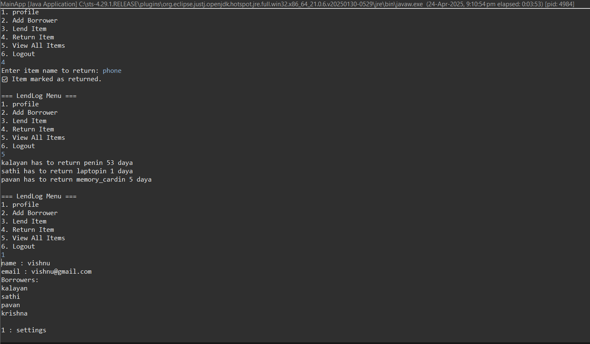
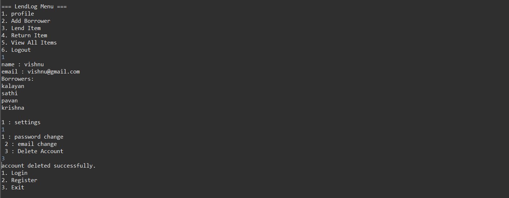

# 📚 LendLog

### 👀 What is this app for?

**LendLog** is a console-based Java application that helps users manage borrowing and lending of items. It is designed to allow multiple users to maintain their personal lending records, with helpful notifications and account management features.

---

### 🚀 Features

- 👥 **Multi-user Support**
- 🔐 **Login & Register**
- ➕ **Add Borrower**
- 📦 **Lend Item**
- 🔁 **Return Item**
- ⏰ **Login Notification if Return Due in 2 Days**
- ✉️ **Change Email & Password**
- 🗑️ **Delete Account**

---

### 🛠 Tech Stack

- 💻 Java (Core + JDBC)  
- 🛢 MySQL  
- 🧱 SQL (DDL & DML)  
- 🖥️ Plain ol’ Java Console I/O

---

### ⚙️ How the App Works

1. User registers or logs in via console.
2. After login, the system checks if any item is due for return within 2 days and shows a notification.
3. User can:
   - Add a new borrower
   - Lend items to borrowers
   - Return borrowed items
   - View their lend/return history
   - Change email/password
   - Delete their account
4. All data is stored in a MySQL database using JDBC.

---

### 📸 Screenshots

#### 🔐 Login Page and Register Page

#### ➕ Add Borrower  

#### 📦 Lend Item  

#### 🔁 Return Item  

